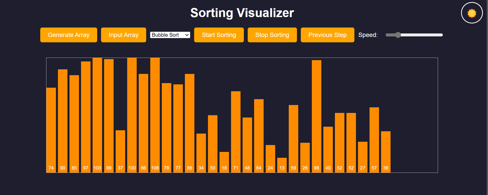
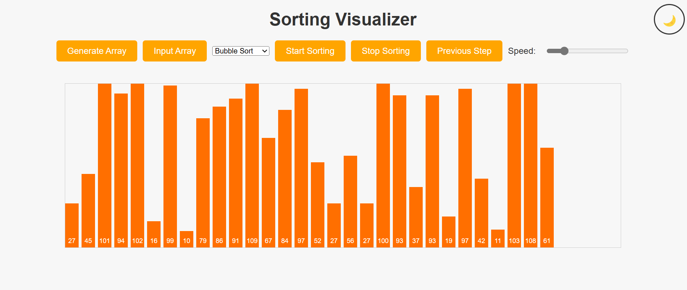

# 🖥️ Sorting Visualizer

Welcome to **Sorting Visualizer**! 🎉 This project is a dynamic and interactive way to learn and understand various sorting algorithms visually. It allows users to generate arrays, input their own arrays, and visualize the sorting process step-by-step. It also features a light/dark mode toggle 🌙☀️ for a personalized user experience.

---

## 📜 **Description**

Sorting Visualizer is designed to help users comprehend how sorting algorithms work through visual representation. You can select from multiple sorting algorithms, adjust the speed of visualization, and control the process with options like "Previous Step" or "Stop Sorting." The theme toggle adds an extra layer of customization for user comfort.  

### Key Features:
- 🎨 **Theme Toggle**: Switch between light and dark modes for better readability.
- 🎲 **Random Array Generation**: Generate a random array to start sorting.
- 🛠️ **Custom Input**: Provide your own array of numbers for sorting.
- 📈 **Real-Time Visualization**: Watch sorting algorithms in action.
- ⚡ **Adjustable Speed**: Change the visualization speed using a slider.
- 🖱️ **Easy Controls**: Buttons to start, stop, or rewind sorting steps.

---

## 🛠️ **Setup Instructions**

Follow these steps to set up and run the Sorting Visualizer on your system:

### **1. Clone the Repository**
```bash
git clone https://github.com/SrujanPR/Sorting-Visualizer.git
```

### **2. Navigate to the Directory**
```bash
cd Sorting-Visualizer
```

### **3. Open the Project**
Open the `index.html` file in your preferred web browser.

### **4. Start Sorting!**
- Use the buttons and dropdown menus to interact with the visualizer.
- Toggle between light and dark modes using the 🌙☀️ button.

---

## 📖 **Available Sorting Algorithms**

### **1. 🫧 Bubble Sort**
- **Description**: A simple comparison-based algorithm that repeatedly steps through the list, compares adjacent items, and swaps them if they're in the wrong order.
- **Complexity**:
  - **Best Case**: O(n)
  - **Worst Case**: O(n²)
  - **Average Case**: O(n²)

---

### **2. ✂️ Selection Sort**
- **Description**: Divides the list into a sorted and unsorted part. Repeatedly selects the smallest element from the unsorted part and moves it to the sorted part.
- **Complexity**:
  - **Best Case**: O(n²)
  - **Worst Case**: O(n²)
  - **Average Case**: O(n²)

---

### **3. ✏️ Insertion Sort**
- **Description**: Builds the sorted array one element at a time by picking each element and inserting it into its correct position.
- **Complexity**:
  - **Best Case**: O(n)
  - **Worst Case**: O(n²)
  - **Average Case**: O(n²)

---

### **4. ⚡ Quick Sort**
- **Description**: A divide-and-conquer algorithm that picks a "pivot" element, partitions the array into two halves, and recursively sorts them.
- **Complexity**:
  - **Best Case**: O(n log n)
  - **Worst Case**: O(n²)
  - **Average Case**: O(n log n)

---

### **5. 🧩 Merge Sort**
- **Description**: A divide-and-conquer algorithm that splits the array into halves, sorts them recursively, and merges them back.
- **Complexity**:
  - **Best Case**: O(n log n)
  - **Worst Case**: O(n log n)
  - **Average Case**: O(n log n)

---

### **6. 🏔️ Heap Sort**
- **Description**: Utilizes a binary heap structure to repeatedly extract the maximum element and build the sorted list.
- **Complexity**:
  - **Best Case**: O(n log n)
  - **Worst Case**: O(n log n)
  - **Average Case**: O(n log n)

---

## 🎨 **How to Use**

1. Click **"Generate Array"** to create a random array of numbers.
2. Use **"Input Array"** to provide your own list of numbers.
3. Select a sorting algorithm from the dropdown menu.
4. Adjust the speed slider to set the visualization speed.
5. Press **"Start Sorting"** to begin visualization.
6. Use **"Stop Sorting"** or **"Previous Step"** to control the process.
7. Toggle the theme using the 🌙☀️ button to switch between light and dark modes.

---

## 🌟 **Technologies Used**

- **HTML**: For the structure of the application.
- **CSS**: For styling and themes.
- **JavaScript**: For interactivity and algorithm implementation.

---

## 🤝 **Contributing**

We welcome contributions! Feel free to fork this repository, make changes, and submit a pull request. For major changes, please open an issue first to discuss your ideas.

---

## 📜 **License**

This project is licensed under the [MIT License](https://opensource.org/licenses/MIT).

---

## 📷 **Preview**






